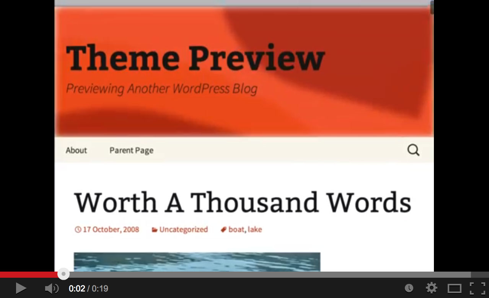
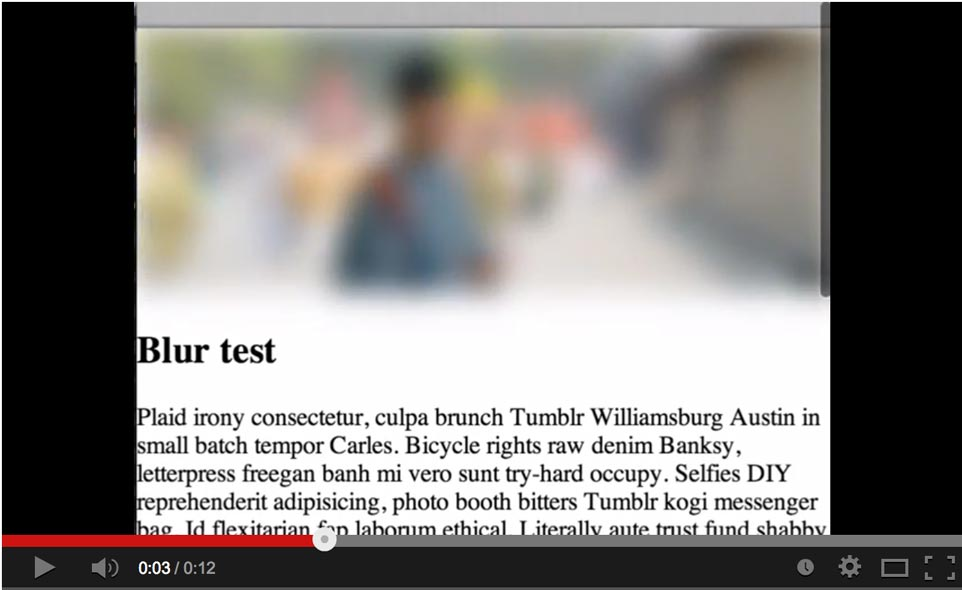

Negative Scroll Blur
====================

Make stuff zoom and blur when there's negative top scroll.  Completely superfluous yet fun.  Intended for page heading graphics.

Inspired by UI seen on the Foursquare app.

[Demo](http://davidbcalhoun.com/a/negative-scroll-blur.html)

Video
====================

Dependencies
====================
0 dependencies.  Works in pure JavaScript.

Usage
====================
You have two options:
* Add the id "blurMe" on the element you want blurred
* Scroll to the end of the JavaScript and change "#blurMe" to the jQuery-like selector you'd like to use (note: querySelector is used under the hood, NOT jQuery)

Options can be passed in as a second parameter.  Currently only zoom:true is supported (see example).

Support
====================
Tested to work in:

* Chrome 31+
* Safari 7.0+
* iOS 7 (tested on iPad 2)

(should theoretically work wherever [CSS filters are supported](http://caniuse.com/css-filters))

TODO
====================
* blur with Canvas (seems to be more performant than CSS)
